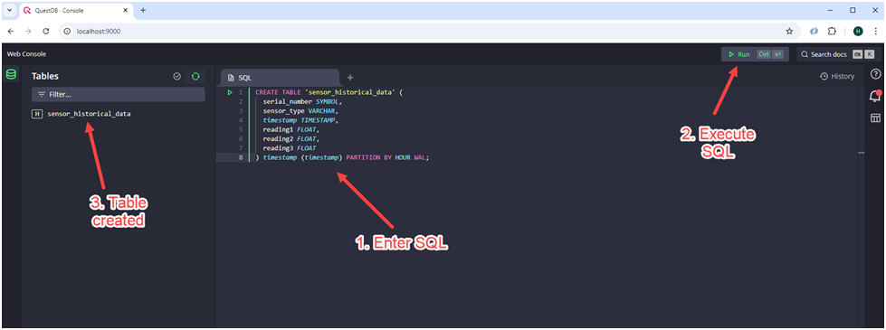

1.	Developing on Windows OS, we first need to install a full version of the Linux OS, we need this to create and build Docker images and containers.  Windows store comes with a flavor of Ubuntu LTS linux.  We can run what is called Windows Subsystem Linux (WSL) OS on windows and keep our development on Windows

    a.	Go to Windows Store, search for “ubuntu” and choose WSL Ubuntu 24.04 LTS, this is the latest long term support version at the time of this writing.
        

    b.	Install the Ubuntu WSL from the Windows Store

2.	Download Docker Desktop for Windows OS version here -> Docker Desktop: The #1 Containerization Tool for Developers | Docker
    a.	Make sure you set your Windows machine to enable Virtualization, to verify, open Task Manager, under Performance tab, you should see the following:
        
    
    b.	Install Docker Desktop, when ask if you want to use Hyper V or WSL, choose WSL because we are using Ubuntu WSL, this will give us a development environment that is similar to our production environment.
    c.	Run Docker Desktop
    d.	Go to Settings->Resources->WSL Integration, and enable integration for WSL distro, in our case it’s Ubuntu as shown below:
        
    

3.	Keep Docker Desktop open and make sure WSL is running by restarting your Windows
4.	Install development IDE of your choice, VS Code is good, please go here to get the latest version of  VS Code IDE -> https://code.visualstudio.com/
5.	Clone this project from github from the main branch
6.	Open VS Code, under “File” -> “Open Folder”, choose the folder of clone project
7.	Under “Terminal” -> “New Terminal”, enter the docker command: docker compose run --entrypoint="" frontend npm install
8.	Step 7 will be a few minutes depending on your internet speed as it is downloading all the necessary node modules.
9.	Once done, you should see a folder called “node_modules” under the “frontend” folder which is the Sveltekit front end application.
10.	In the Terminal, run the docker command: docker compose up –build
11.	Open the browser and enter the url “localhost:9000”, this will bring up QuestDB web interface, enter the following SQL to create the “sensor_historical_data” table, click on the “Run” button at the top left to create the table as shown below:

	CREATE TABLE 'sensor_historical_data' (
	  serial_number SYMBOL,
	  sensor_type VARCHAR,
	  timestamp TIMESTAMP,
	  reading1 FLOAT,
	  reading2 FLOAT,
	  reading3 FLOAT
	) timestamp (timestamp) PARTITION BY HOUR WAL;

    

 
     
12. Open another browser tab and enter the url “localhost:3000”, this is the Svelte application being serve on port 3000, you should see the following:
    
 
13. At this point all docker services are all up and running, Kafka broker, Backend service written in Golang, QuestDB database, and front end application Sveltekit app.  We need to run the sensor simulator program written in Golang to see data flowing in. See next step.
14. In VS Code IDE, open another terminal, you should already be in the folder of the project already, change directory to “sensor-simulator” as shown below.  Then enter the command: go run main.go, the simulator will run and you can watch the sensor data coming in on the web browser at the url: localhost:3000 
    
 

