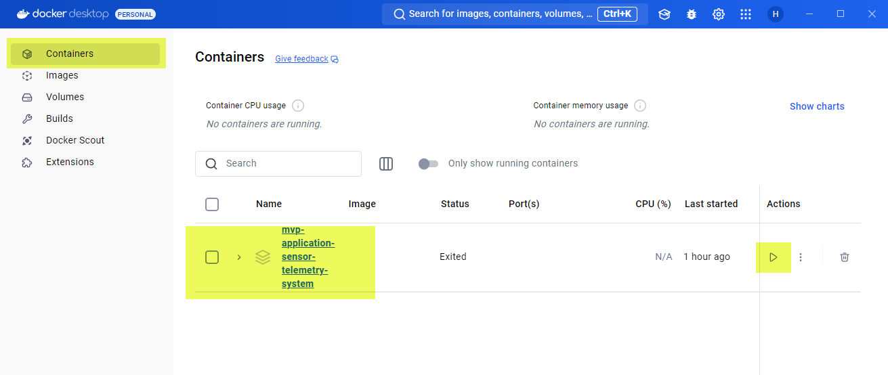

# Minimal Viable Product (Sensor Data Telemetry)

This project adopts a modular design and a different architectural approach, serving as a proof of concept applicable to both current and future software products at Mesa. It will ingest sensor data from external sources, store and process that data to generate reports, and display the information in real-time.
    -Golang programming language
    -Apache Kafka message broker
    -QuestDB database
    -Svelte.js and Sveltekit
    -Tailwind CSS 
    -Websocket protocol

## Table of Contents

- [Features](#features)
- [Requirements](#requirements)
- [Installation](#installation)
- [Usage](#usage)

## Features

- Live display of sensor data on the dashboard over websocket with tabular view and chart view
- Utilize QuestDB high performance SQL to generate large data set report including historical, Minimum values, Maximum values, and Average values
- Utilizing docker to setup the development environment 

## Requirements

1. Windows Subsystem Linux (WSL), this is needed to create and build Docker images and containers if you are running Windows OS only.
2. Docker Desktop at: https://www.docker.com/products/docker-desktop/
3. Node.js with NPM at: https://nodejs.org/en
4. A development environment if you would like to continue developing the project, VS Code IDE at: https://code.visualstudio.com/
5. Git for windows if your OS is Windows: https://git-scm.com/downloads/win
6. Git for MAC if your OS is macOS: https://git-scm.com/downloads/mac
7. Git for Linux and Unix if your OS is such: https://git-scm.com/downloads/linux

## Installation

1. **Install Windows Subsystem Linux (WSL):**
    1. If you are running Windows, please continue, if you are using MAC or Linux OS, please skip this step and move to step 2, "Install Docker Desktop"
    2.	Go to Windows Store, search for “ubuntu” and choose WSL Ubuntu 24.04 LTS, this is the latest long term support version at the time of this writing.
        

    3.	Install the Ubuntu WSL from the Windows Store

2. **Install Docker Desktop:**
    1. Please go to: https://www.docker.com/products/docker-desktop/ and download Docker Desktop for your operating system
    2. Ensure you set your machine to enable Virtualization.  To verify on Windows, open Task Manager, under Performance tab, you should see "Virtualization: Enabled" as shown below:
       
    3. Install Docker Desktop using the file you just downloaded.  On Windows OS, when ask if you want to use Hyper V or WSL, choose WSL.
    4. If your operating system is Windows, run Docker Desktop when it finished installing. Then, go to "Settings", then choose "Resources", select WSL Integration, and check the box "enable integration for WSL distro"
       
    5. Restart your computer

3. **Install Node.js with NPM**
    1. Please go to: https://nodejs.org/en and download the Node.js, recommend Node.js (LTS) v22.11.0 or any later LTS version
    2. Install the Node.js on your computer
    3. Open a terminal shell on your computer and verify that NPM is installed, run this command: npm -v

4. **Install Visual Studio Code IDE:**
    1. If you would like to develop with this project continue, then continue, if you just want to run the project using docker, proceed to step 4 (Install Git)
    2. You can use any IDE of your choice, but if you would like to use VS Code, download it here: https://code.visualstudio.com/
    3. Install the VS Code IDE

5. **Install Git:**
    1. Please download the Git package for your operating system using the link in the "Requirements" section
    2. Install Git

6. **Clone the MVP repository:**
    1. Navigate to the location where you would like to clone the project to
    2. Open git bash
    3. Run the following command: `git clone https://github.com/hunghpham/MVP-Application-Sensor-Telemetry-System.git`
    4. A folder of the project named "MVP-Application-Sensor_Telemetry-System" is created with the project cloned from github

## Usage

1. **Run The Project With Docker Only**
    1. Please run the Docker Desktop application
    2. If the OS is Windows, open Command Prompt or Windows power shell. If using other OS, use their terminal shell application
    3. Navigate in to where the folder of the project "MVP-Application-Sensor_Telemetry-System", the root of the project.  You can either clone the project like shown in "Clone the MVP repository" or you can download the latest release source code.
    4. Run the docker command: `docker compose run --entrypoint="" frontend npm install`
    5. Wait until the installation of node modules are complete, it can take up to 5 minutes, since node modules is quite large
    6. Run the docker command: `docker compose build`
    8. In the Docker Desktop application a container is created with the MVP project name under "Containers", you can click the play button under "Actions" to start the docker container.
            
    9. Open a browser and enter the url: http://localhost:3000
    10. As the docker images are being spin up, keep waiting and the application will start up with simulation sensor data flowing through, you can hit the refresh button on the browser if your browser is caching something. 
        
    11. Done, you can now use the MVP application

2. **Run The Project For Development**
    1. Please run the Docker Desktop application
    2. Open an IDE of your choice, we will Visual Studio Code as example here
    3. In VS Code, File->Open Folder, and choose the "MVP-Application-Sensor_Telemetry-System" folder, which is the root of the project
    4. Open a terminal in VS Code
    5. Run the docker command: `docker compose run --entrypoint="" frontend npm install`
    6. Wait until the installation of node modules are complete, it can take up to 5 minutes, since node modules is quite large
    7. Run the docker command: `docker compose up --build` or `docker compose build` if you don't want to run the docker services yet
    8. If you ran the command `docker compose up --build`, open a browser and enter the url: http://localhost:3000
    9. As the docker images are being built, keep waiting and the application will start up with simulation sensor data flowing through, you can hit the refresh button on the browser if your browser is caching something.
        
    10. Done, you can now start developing with the MVP project

    

